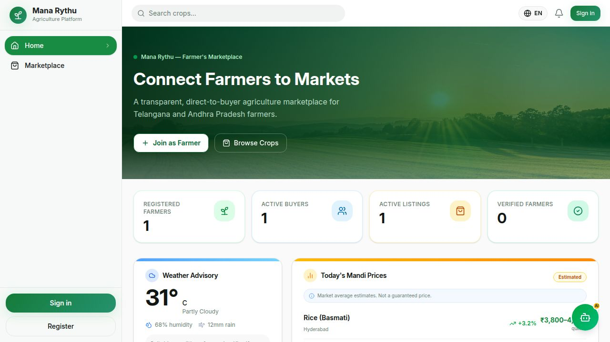
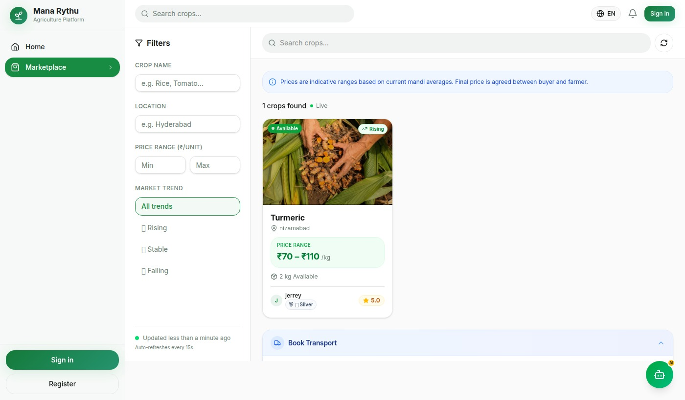
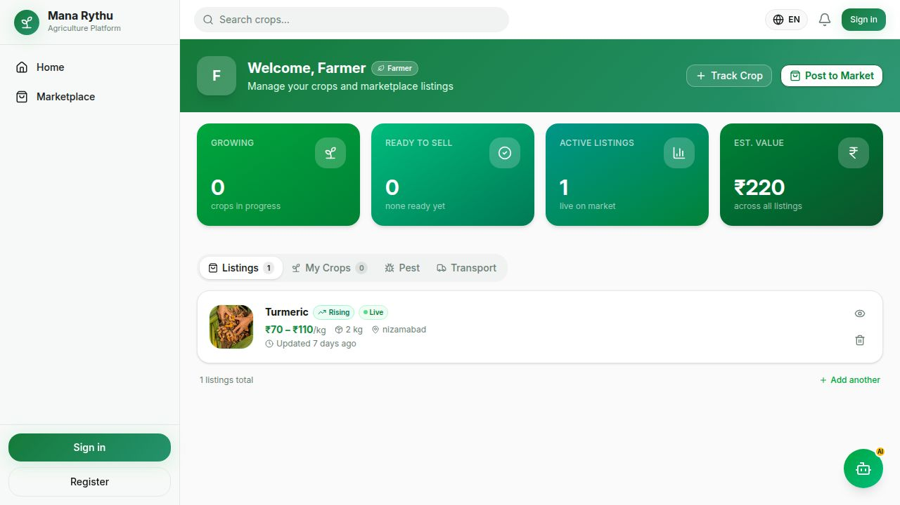
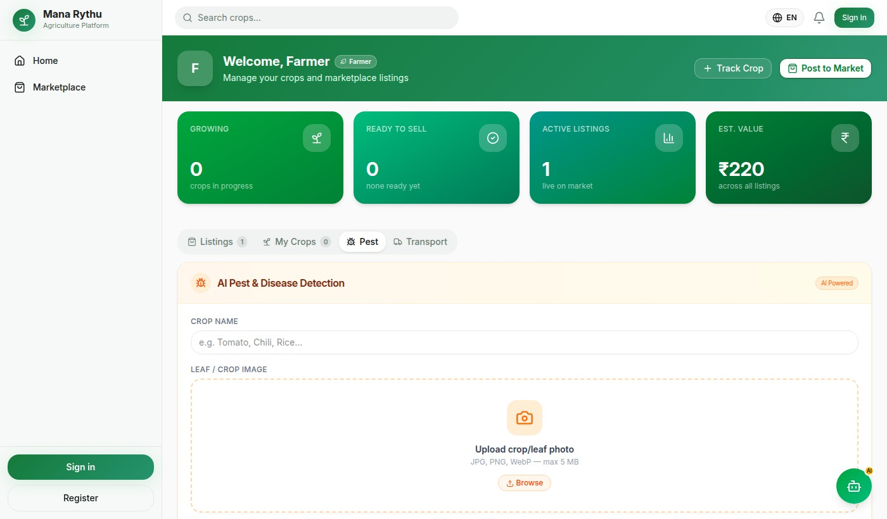
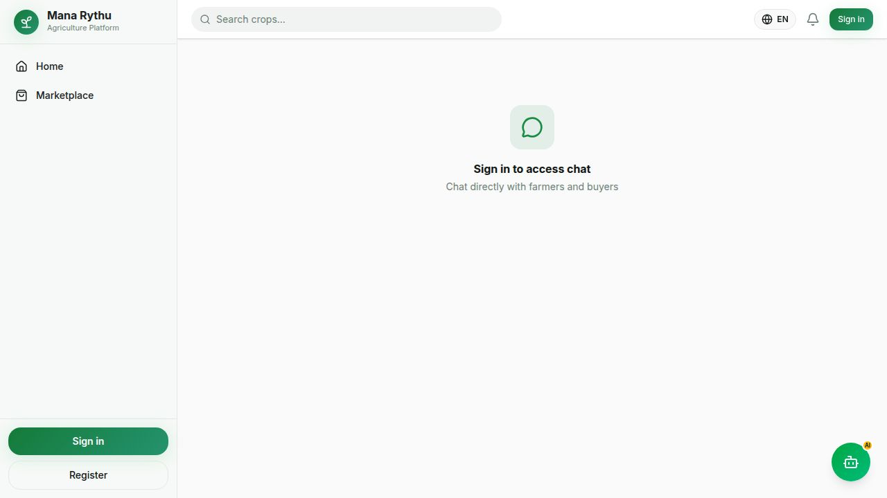

<div align="center">

# 🌾 Mana Rythu · మన రైతు

### The operating system for Indian agriculture

**Direct farmer-to-buyer commerce, AI crop intelligence, and transparent pricing — in one mobile-first platform.**

[](https://mana-rythu-ai.replit.app/)
[](https://github.com/rachanareddy-data/mana-rythu)
[](https://mana-rythu-ai.replit.app/pitch-deck/)

</div>

---

## Problem

India has over 140 million farmers, yet most capture only a fraction of what their crops are worth.

- **Limited market access** — a small circle of intermediaries leaves crops sold below fair value.
- **Price transparency challenges** — traditional mandis offer little visibility into real-time rates.
- **Lack of digital tools** — expert agronomic guidance rarely reaches rural farmers.
- **Language barriers** — most agri-tech is built English-first, excluding regional-language speakers.

---

## Solution

### 🛒 Marketplace
Direct farmer-to-buyer crop trading without intermediaries.

### 🌱 AI Crop Intelligence
AI-powered crop disease and pest detection using images.

### 📊 Price Intelligence
Fair-price benchmarking and market transparency.

### 🤖 AI Assistant
Multilingual farming guidance in Telugu and English.

### 💬 Real-Time Communication
Real-time chat between farmers and buyers.

---

## 📸 Product Screenshots

### Home


### Marketplace


### Farmer Dashboard


### AI Assistant


### Real-Time Chat


---

## Why Now

The conditions for digital agriculture in India have only recently converged.

- **AI maturity** — models can now diagnose a crop from a photo and respond in regional languages.
- **Smartphone adoption** — affordable devices have reached deep into rural communities.
- **Digital payments** — UPI has normalized cashless transactions across small towns and villages.
- **Agriculture digitization** — public and private investment is pulling farming workflows online.

---

## Architecture

```
        Farmer / Buyer
              │
              ▼
       React Frontend
     (Vite · TypeScript)
              │
              ▼
        Express API
   (OpenAPI · Zod validation)
              │
              ▼
        PostgreSQL
       (Drizzle ORM)
              │
              ▼
       OpenAI GPT-4o
```

- **Type-safe APIs** — types flow from schema to frontend without drift.
- **OpenAPI contracts** — one contract drives generated client hooks and server validation.
- **Zod validation** — every request and response is validated at runtime.
- **Mobile-first** — designed for low-bandwidth devices before scaling up.

---

## Tech Stack

**Frontend**


**Backend**


**Database**


**AI · Infrastructure**


---

## Impact

- **Direct access** — removing intermediaries so more of each sale reaches the farmer.
- **AI-assisted decisions** — crop diagnosis previously out of reach in rural areas.
- **Transparency** — visibility into fair market rates before a deal is made.
- **Accessibility** — regional-language, mobile-first design for first-time smartphone users.

---

## Roadmap

| Status | Feature | Description |
|---|---|---|
| 🔴 Near-term | **UPI Payments** | In-app payments via UPI for end-to-end transactions |
| 🔴 Near-term | **Weather Intelligence** | Hyperlocal alerts for planting and harvest decisions |
| 🟡 Mid-term | **Crop Price Forecasting** | Regional price prediction to time sales |
| 🟡 Mid-term | **Logistics Tracking** | End-to-end shipment tracking for crop deliveries |
| 🟡 Mid-term | **AI Disease Detection** | Expanded photo-based crop disease identification |
| 🟢 Planned | **Multi-language Expansion** | Hindi, Kannada, and Marathi support |

---

## Getting Started

```bash
git clone https://github.com/rachanareddy-data/mana-rythu.git
cd mana-rythu

pnpm install

cp .env.example .env
# Fill in DATABASE_URL, SESSION_SECRET, OPENAI_API_KEY

pnpm --filter @workspace/db run push

pnpm --filter @workspace/api-server run dev    # API
pnpm --filter @workspace/mana-rythu run dev    # Frontend
```

---

## Author

**Rachana Baddam** · M.S. Data Science, Saint Peter's University
[GitHub](https://github.com/rachanareddy-data) · [Live Demo](https://mana-rythu-ai.replit.app/)

---

<div align="center">

### 140 Million Farmers. One Fair Market.

**Built with AI. Built for Farmers.**

</div>
